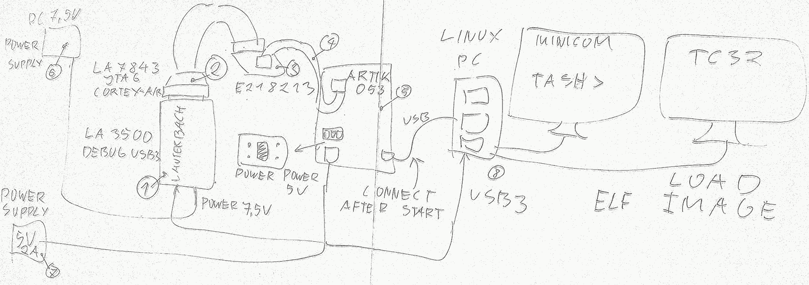

# Lauterbach debugging of TizenRT

## Introduction
This document describes how Lautherbach debugger can be used to debug TizenRT
at Artik 053. Lautherbach is hardware debugger for ARM SoC. You need to contact
Lauterbach sales to obtains all components, software and licenses necessary
for this debugging solution.

See: http://www.lauterbach.com (there is not https page)


## Hardware

You need several components:

1. LA-3500 Debuger-USB3
2. LA-7843 JTAG Cortex A/R
3. E21823 JTAG -> Cortex Debug converter.
4. Cortex Debug cable.
5. Artik 053.
6. DC 7,5 V power supply for LA-3500.
7. DC 5 V power supply for Artik 053 (powering over USB from PC causes issues).
8. Ubuntu Linux PC with USB3 and USB2.



## Software

You need trace32 Linux application with dependencies. Using QT version of UI
is the most straightforward for Ubuntu so you need QT UI libraries in your
Linux PC.

You can download trace32 from Lauterbach web page.

## Configuration

You need to configure UDEV so your Linux kernel can see Lauterbach over USB3.
Your udev configuration should be present in udev.conf folder in Lauterbach
software. Please don't forget to reboot or restart UDEV so it will load new
configuration.

Follow Lauterbach installation guide and install trace32 into
_/opt/t32_ folder.

If you install your trace32 into default folders, then you case set
environment variables:

    export T32SYS=/opt/t32mini
    export T32TMP=/tmp
    export T32ID=T32
    export PATH=$PATH:/opt/t32/bin/pc_linux64

Copy:

    Lauterbach_artik053.cmm
    
file from this documentation folder into

    /opt/t32/Lauterbach_artik053.cmm

This configuration script support device flashing. You should set ```do_flash```
to zero if you want to just debug and to one to flash your image to Artik053

    &do_flash=0


## Debugging


Start trace32 from shell:

    t32marm-qt -c /opt/t32/config.t32 -s /opt/t32/Lauterbach_artik053.cmm

You have to find debug window and execute command to load your TizenRT image:

    Data.LOAD.Elf /home/piotr/src/tizenrt/build/output/bin/tinyara

It has to be the same image, which was used to flash Artik053. You can use
trace32 debugger to inspect assembler, CPU state, execute your software step
by step or create breakpoints for functions and events.

USB connection to PC can distrupt your debugging session if USB debugger of
JTAG will activate. You should start debuggign session with PC USB disconnected
from Artik053 debugging port. It is better to power artik from DC Barrel Jack
connector. You can connect USB from PC to Artik053 after debugging session
was started. It provides access to UART over USB so you can use TASH console
to test your application and debug it over JTAG fro Lauterbach.

